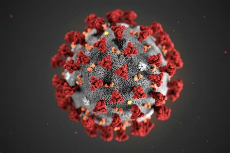

# COVID-19 Contact Tracing

- A toolkit to analyze the spread of COVID-19 among a population considering the interactions between them
- Developed in C++ by Arjun Krishna with assitance from The University of Waterloo and Profesor Igor Ivkovic

## Basic Functionality
- Given the interactions between a population (time and place of meetings amongst them) it provides insight into the spread of the virus
- Allow users to logically analyze possible meetings and impress the importance of social distancing